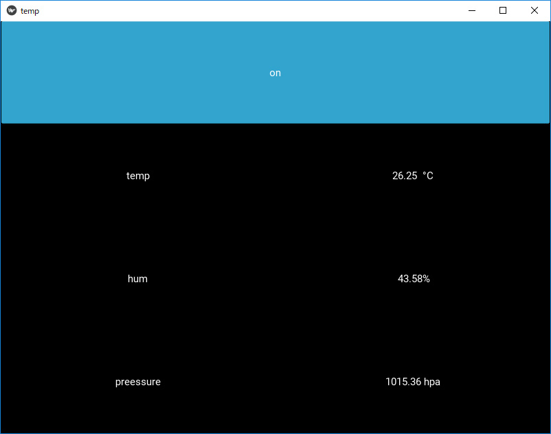
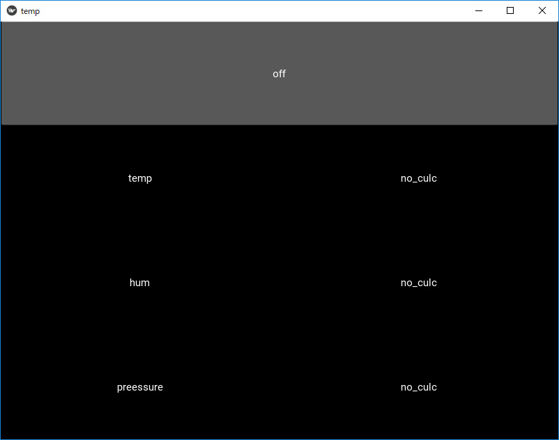
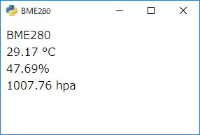
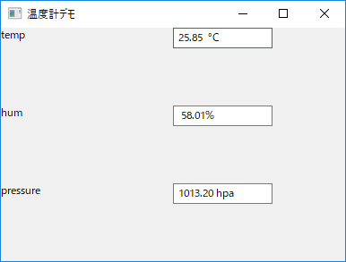

# AN-USB-BME280

https://github.com/nonNoise/USB_ScienceKit の温度センサーを取得するAN-USB-BME280をPythonのGUIライブラリで表示しています。

# Kivy の場合

トグルボタンを使って温度センサーの取得のon/offに対応しました。 

温度センサーの取得オン

温度センサーの取得オフ

動かした動画は以下のリンク先にあります。
<blockquote class="twitter-tweet" data-lang="ja">
技術書典４で買った<a href="https://twitter.com/nonNoise?ref_src=twsrc%5Etfw">@nonNoise</a>の温度センサー。これはすごい！！ ドライバーのインストールも簡単でなによりPythonで値が取得できる。 ラズパイよりも全然簡単なのでおすすめ。<a href="https://twitter.com/hashtag/%E6%8A%80%E8%A1%93%E6%9B%B8%E5%85%B8?src=hash&amp;ref_src=twsrc%5Etfw">#技術書典</a>　<a href="https://twitter.com/hashtag/%E6%8A%80%E8%A1%93%E6%9B%B8%E5%85%B84?src=hash&amp;ref_src=twsrc%5Etfw">#技術書典4</a> <a href="https://t.co/A5dq0sgeG1">pic.twitter.com/A5dq0sgeG1</a>
&mdash; okazaki jun (@dario_okazaki) <a href="https://twitter.com/dario_okazaki/status/988445093907415041?ref_src=twsrc%5Etfw">2018年4月23日</a></blockquote>

# eel の場合

eel( https://github.com/ChrisKnott/Eel )を使って温度を表示しています

# wxPython の場合

wxPython( https://www.wxpython.org/ )を使って温度を表示しています

